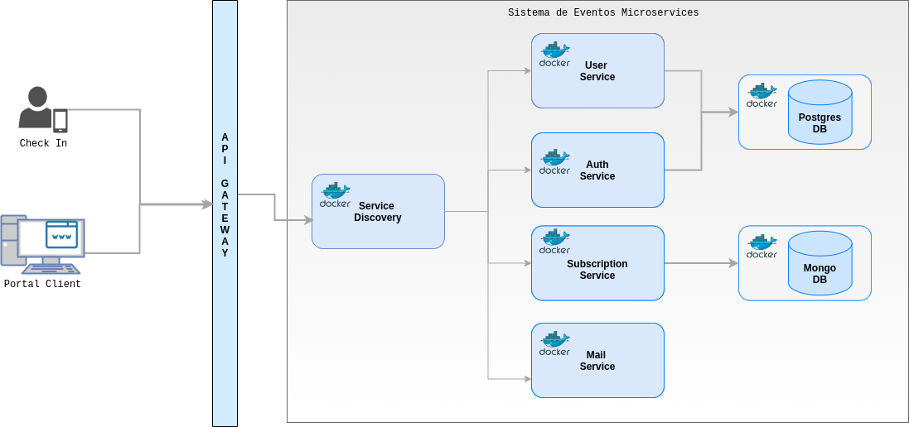
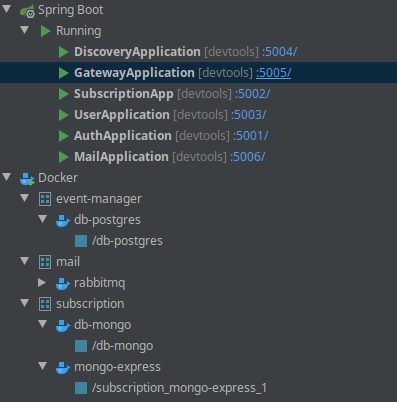

# Event-manager

[Api Backend](https://github.com/Magaiwer/event-manager) - event-manager

[Frontend Angular](https://github.com/Magaiwer/event-manager-client) - event-manger-client
 
[Aplicativo mobile ](https://github.com/Magaiwer/event-checkin-mobile) - event-checkin client mobile para realizar check In offline

### Sistema de gerenciamento de inscrições em eventos utilizando conceitos de micro serviços 

### Requisitos:
   [Descrição dos requisitos e escopo do projeto ](/resources/projeto-requisitos.pdf)   

### Tecnologias:
- Spring boot 2.1.3.RELEASE https://spring.io/guides/gs/spring-boot/
- Java 11 LTS
- Postgresql
- MongoDB
- Docker
- Docker compose
    
 ### Arquitetura:
 
 
 ### Portas e serviços
  
